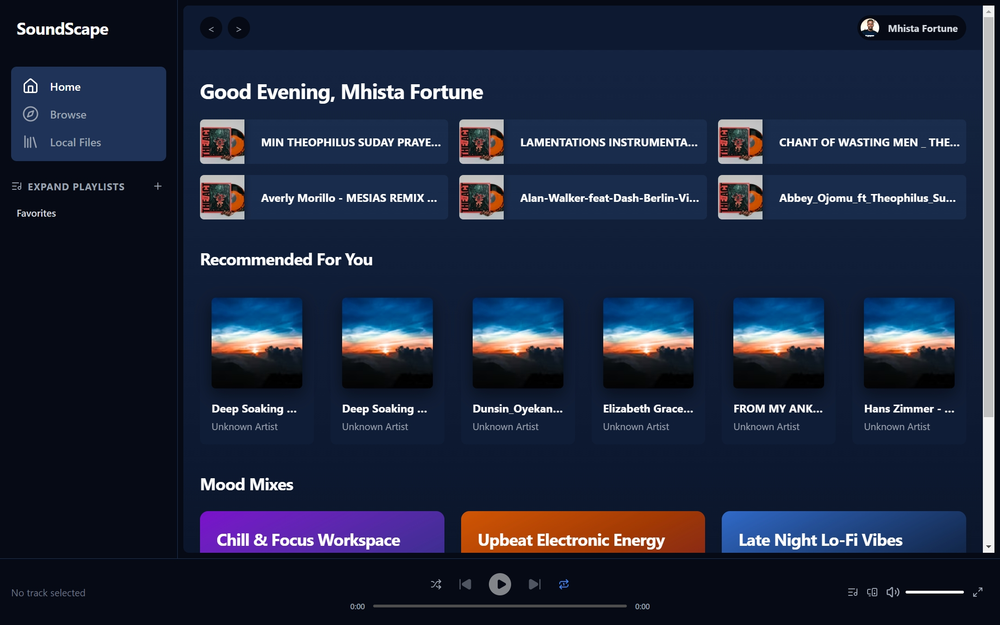
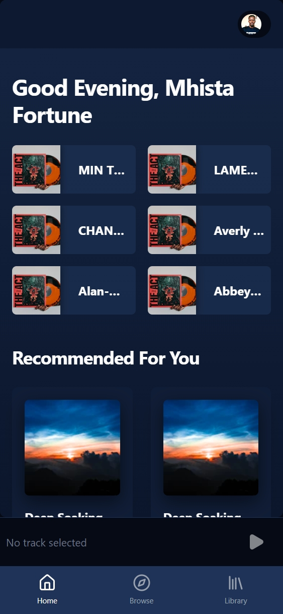
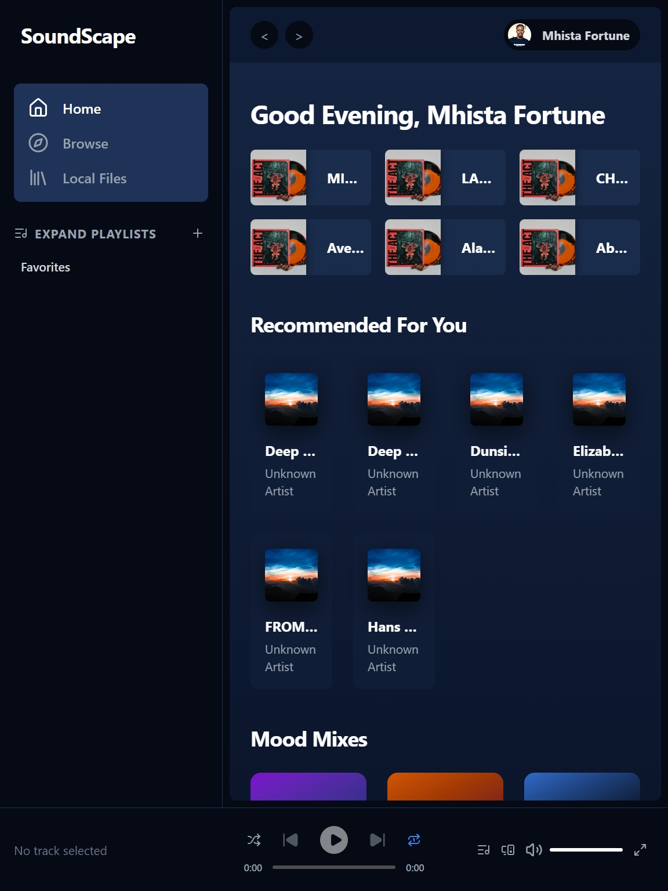

# SoundScape Music App

SoundScape is a modern, feature-rich custom-built music streaming web application built with React and Tailwind CSS. It provides high-fidelity audio playback, seamless local file imports, and immersive dynamic layouts built for premium aesthetics.

## Screenshots





## Features

### 🎵 Core Features
- **High-Fidelity Audio Engine:** Seamless HTML5-powered `<audio>` foundation supporting play, pause, progress seeking, and volume adjustments.
- **Smart Playback Controls:** Native support for **Shuffle**, **Repeat-All**, and **Repeat-1** modes mapped seamlessly to the UI and playback queue.
- **Local File Import:** Import `.mp3`, `.wav`, or `.m4a` files directly from your mobile device or computer to play your own offline library.
- **Native OS Media Integration:** Complete lock screen and notification control integration using the native `MediaSession` API.
- **Persistent State Storage:** Playlists, History, Favorites, and User metadata are securely retained across sessions via `localStorage`.
- **Responsive Overlay:** Fluid mobile-first UI grids prioritizing album cover art styling and a truly native app "feel".

### ⚙️ Smart Customization Features [NEW]
Tailor your music experience directly to your aesthetic needs:
- **Custom Authentication & Profiles:** Sleek user onboarding flows supporting username adjustments and local profile settings.
- **Configurable Avatars:** Personalize your music hub with dynamic, rich picture uploading.
- **Premium Themes:** Polished deep navy gradients, glassmorphic panels, and carefully tailored typefaces.

### 🛠 Tech Stack
- **Framework:** React 18 + Vite
- **Styling:** Tailwind CSS + Lucide React (Icons)
- **State Management:** Zustand (w/ Persistence Middleware)
- **PWA Ready:** Installable and optimized for Desktop & Mobile

## Getting Started

1. **Clone the repository**
   ```bash
   git clone https://github.com/MhistaFortune/codealpha_music_app.git
   cd CodeApha_Music_App
   ```

2. **Install dependencies**
   ```bash
   npm install
   ```

3. **Start development server**
   ```bash
   npm run dev
   ```

4. **Build for production**
   ```bash
   npm run build
   ```

## Usage

- **Local Import:** Access the "Library" menu to seamlessly drag-and-drop or select your device's local audio files.
- **Media Controls:** Tap the mini "Bottom Player" bar to expand the full-screen "Now Playing" cover-flow dashboard.
- **Playlists:** Keep track of your favorite tunes directly on your personalized playlists, all stored securely locally.

## Author

- **Developer** - [@MhistaFortune](https://github.com/MhistaFortune)
- **Twitter/X** - [@fortunate_egwu](https://www.twitter.com/fortunate_egwu)

## Acknowledgments

- CodeAlpha for the application assignment and initial project inspiration.
