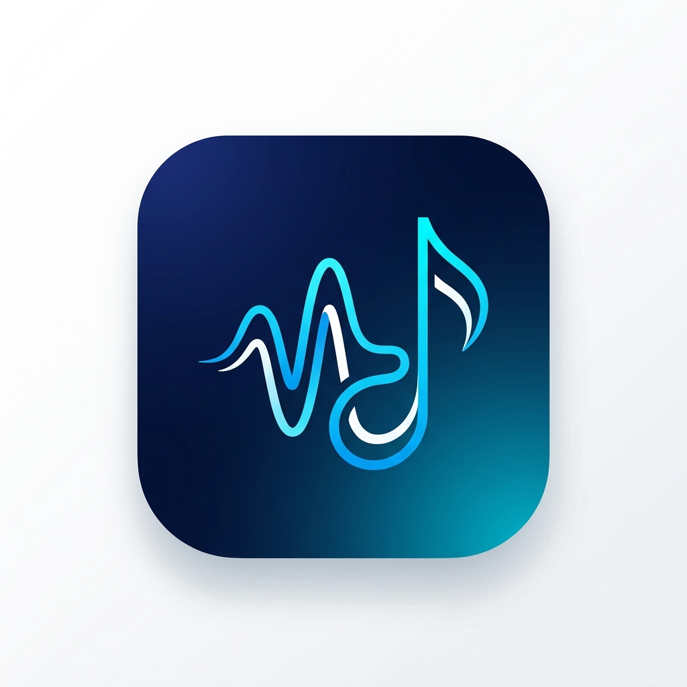

# SoundScape 🎵

SoundScape is a modern, responsive, and high-performance custom-built music streaming web application. Featuring a premium deep navy aesthetic, seamless audio playback, and local file import capabilities, it acts as a fully self-contained music ecosystem right inside your browser.



## ✨ Key Features

- **High-Fidelity Audio Engine**: Seamless HTML5-powered `<audio>` foundation supporting play, pause, progress seeking, and volume adjustments.
- **Smart Playback Controls**: Native support for **Shuffle**, **Repeat-All**, and **Repeat-1** modes mapped seamlessly to the UI and playback queue.
- **Local File Import**: Import `.mp3`, `.wav`, or `.m4a` files directly from your mobile device or computer to play your own offline library. Files are cached securely in memory.
- **Native OS Media Integration**: Hooked up natively with the OS-level `MediaSession` API—meaning your device's lock screen and notification media players will automatically sync the song name, artist, and custom album art while you listen.
- **Persistent State Storage**: Playlists, History, Favorites, and User metadata are all securely retained and synced across sessions via `localStorage`.
- **Responsive "Now Playing" Overlay**: A beautiful full-screen mobile-optimized player viewport, featuring fluid UI/UX layouts to bring your album cover art and controls to life.
- **Custom Authentication & Profiles**: Sleek front-end registration flow with configurable avatars, editable usernames, and password visibility toggles.

## 🛠️ Technology Stack

- **Framework**: React 18 & Vite
- **Language**: TypeScript
- **Styling**: Tailwind CSS
- **State Management**: Zustand (w/ Persistence Middleware)
- **Icons**: Lucide React

## 🚀 Getting Started

### Prerequisites

Ensure you have [Node.js](https://nodejs.org/) (Version 18+) installed on your machine.

### Installation

1. Clone the repository 
2. Navigate into the project directory:
   ```bash
   cd CodeApha_Music_App
   ```
3. Install all necessary dependencies mapping to the standard project tree:
   ```bash
   npm install
   ```

### Running Locally

To start the development server:

```bash
npm run dev
```

Visit the local Vite host address injected into your terminal (usually `http://localhost:5173`) in any modern web browser to open SoundScape.

## 📱 Mobile Support (PWA Ready)

SoundScape is completely optimized for mobile viewports! Because it features zero text-squashing issues and smart responsive grids, you can add it to your iOS or Android Home Screen, where it will gracefully function and handle native audio file-picking identical to a compiled native application.

## 📄 License
This project is for personal portfolio and educational purposes. Ensure you have the rights to any music tracks distributed or uploaded via the Local Files interface.
